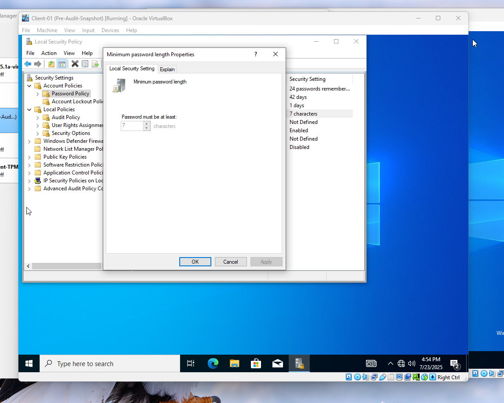
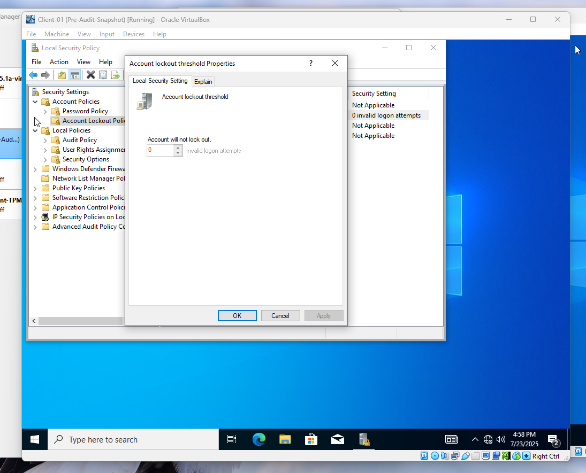
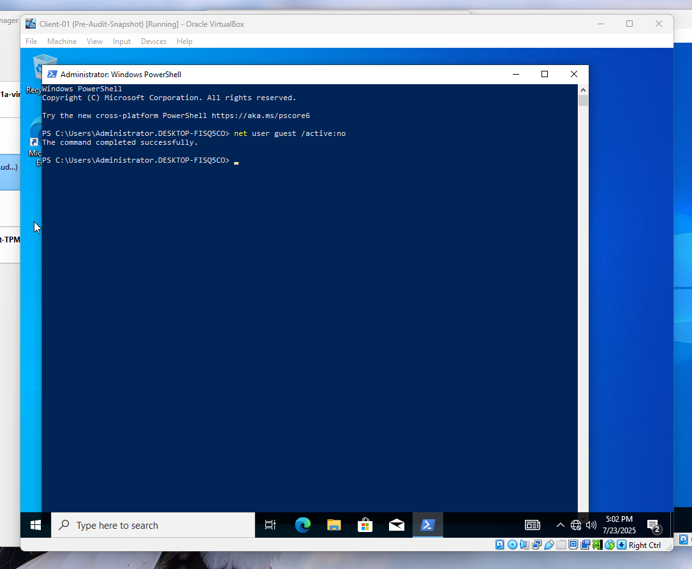
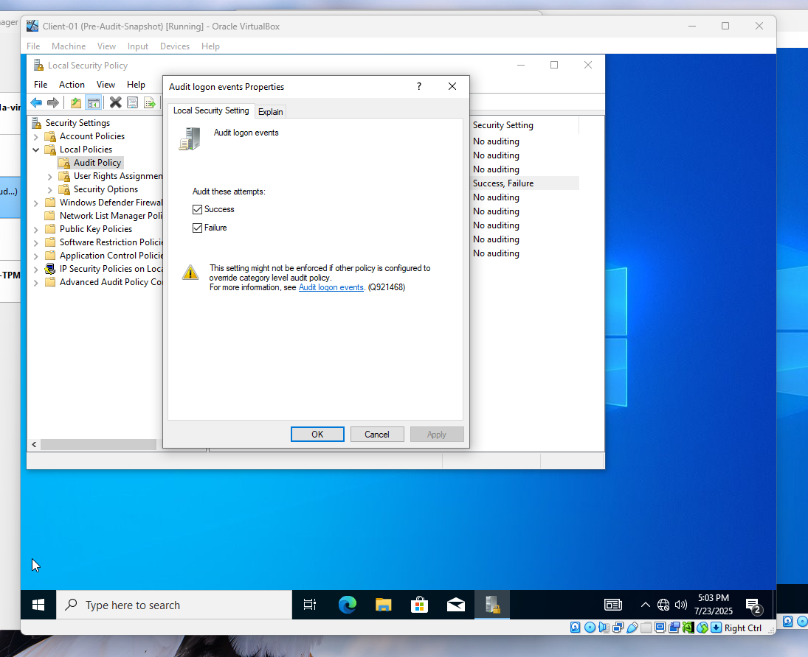
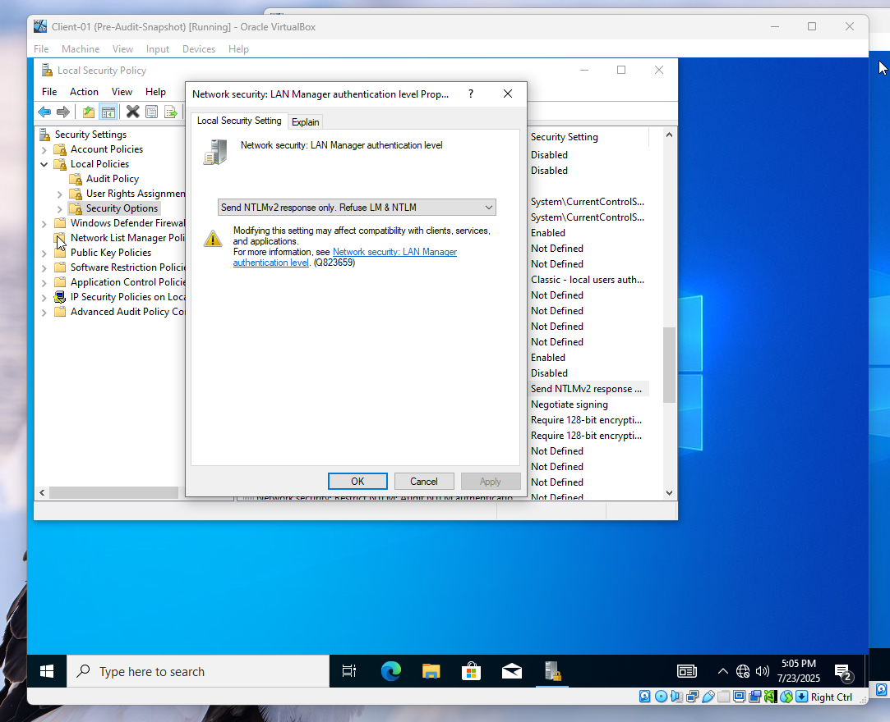
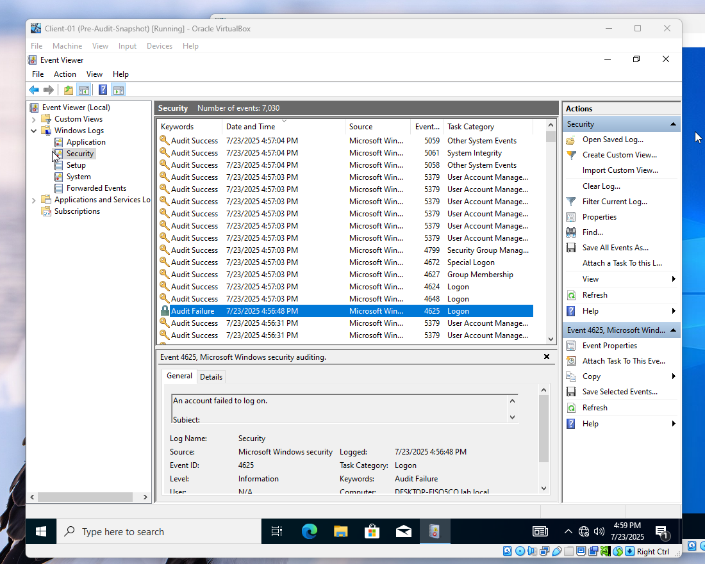
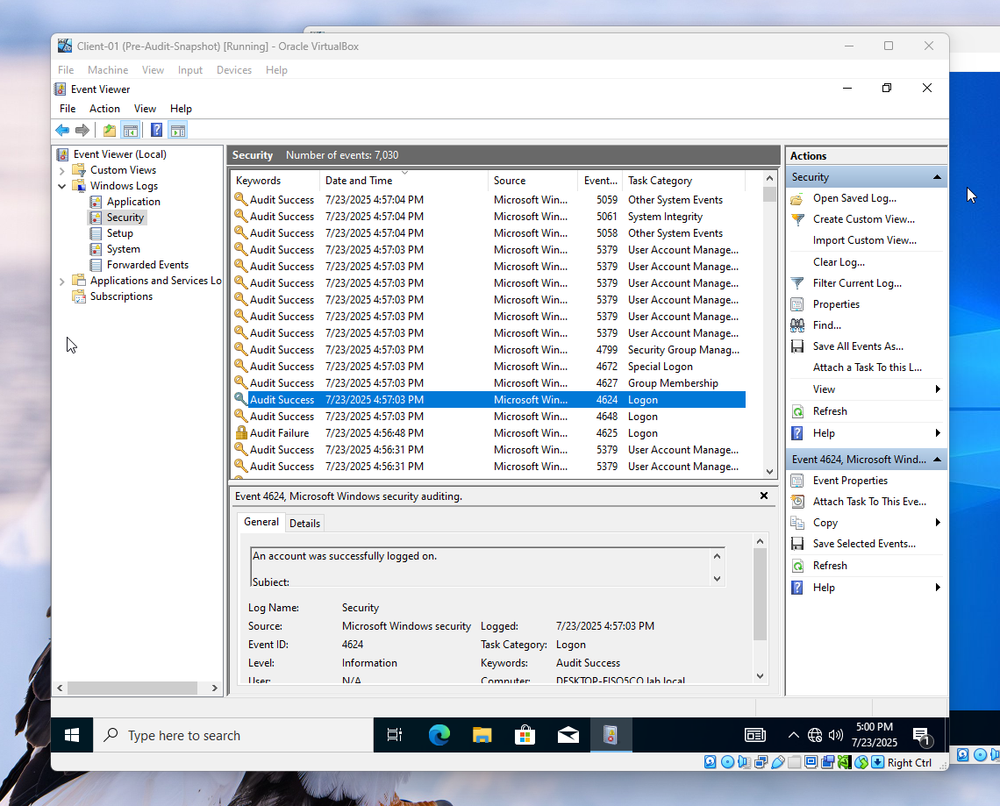

# 🔐 Windows Security Audit – Client-01

**Date:** July 23, 2025  
**Author:** Samuel McKenna  
**Lab Objective:**  
Perform a basic security audit by reviewing and modifying local security policies on a domain-joined Windows 10 workstation (`Client-01`). Document audit results, attempted changes, and domain policy enforcement.

---

## 🖥️ System Info

- Hostname: CLIENT-01
- Domain: lab.local
- OS: Windows 10 Pro
- Logged in as: .\Administrator

---

## 🔍 Audit Findings (Before Changes)

| Category               | Setting                         | Status (Before)        | Notes                             |
|------------------------|----------------------------------|------------------------|------------------------------------|
| Password Policy        | Minimum password length         | 7 (grayed out)         | Domain-controlled                  |
| Account Lockout Policy | Lockout threshold & duration    | 0 (disabled, grayed out) | Domain-controlled                |
| Guest Account          | Guest account status            | Enabled                | Locally changeable                 |
| Audit Policy           | Logon events                    | Not configured         | Locally editable                   |
| NTLM Policy            | LAN Manager authentication level| Send LM & NTLM responses | Locally editable               |

---

## 🔧 Changes Made

### ❌ Password Policy – Domain Controlled
📸   
> Could not modify locally. Setting enforced by domain GPO.

---

### ❌ Account Lockout Policy – Domain Controlled
📸   
> Could not modify locally. Setting enforced by domain GPO.

---

### ✅ Guest Account Disabled
```powershell
net user guest /active:no
```
📸 

---

### ✅ Audit Logon Events Enabled
- Success: ✅  
- Failure: ✅  
📸 

---

### ✅ NTLMv2 Enforced
- Set to: Send NTLMv2 response only. Refuse LM & NTLM  
📸 

---

## 📊 Event Log Verification

- `4625`: Failed login detected  
📸 

- `4624`: Successful login detected  
📸 

---

## 🔄 Reflection

This audit provided insight into which local policies can be modified on a domain-joined system and which are enforced by domain GPOs. It also simulated real-world account recovery, verified policy enforcement, and demonstrated Windows security tools such as `secpol.msc`, `eventvwr.msc`, and PowerShell.

---

## 🔗 Next Steps

- Review and edit domain-level GPOs on DC-01
- Perform a similar audit on a non-domain-joined machine
- Automate checks with PowerShell scripts
